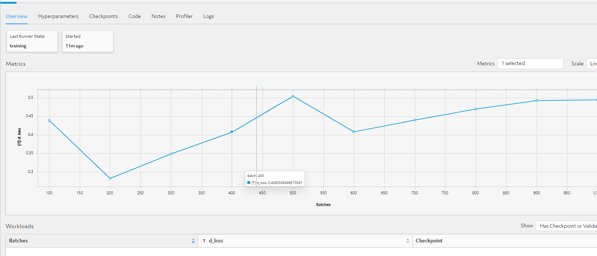

# CGAN TensorFlow Keras GAN Example with Determined AI

This example demonstrates how to build a simple CGAN on the MNIST dataset using Determined's TensorFlow Keras API. This example is adapted from this [Keras Tutorial](https://keras.io/examples/generative/conditional_gan/).
The CGAN Keras model featured in this example subclasses `tf.keras.Model` and defines a custom `train_step()` and `test_step()`.

## Resources
[Keras c_gan](https://keras.io/examples/generative/conditional_gan/)

[Google Colab](https://colab.research.google.com/drive/1m2lUDfmX69iv2e0BXok0K63QQlr2iZ-L#scrollTo=NEY5JcHMo1qA) *Note can be ported to Determined AI JupyterLab.


## Files
* **c_gan.py**: The code code defining the model.
* **data.py**: The data loading and preparation code for the model.
* **model_def.py**: Organizes the model into Determined's TensorFlow Keras API.
* **export.py**: Exports a trained checkpoint and uses it to generate images.

## Configuration Files
* **const.yaml**: Train the model with constant hyperparameter values.
* **distributed.yaml**: Same as const.yaml, but instead uses multiple GPUs (distributed training).

## To Run
Installation instructions can be found under `docs/install-admin.html` or at [Determined installation page](https://docs.determined.ai/latest/index.html).
After configuring the settings in `const.yaml`, run the following command: `det -m <master host:port> experiment create -f const.yaml . `

## To Export
Once the model has been trained, its top checkpoint can be exported and used to generate images by running:
```bash
python export.py --experiment-id <experimend_id> --master-url <master:port>
```

## Demo

### Installtion instructions
*	Start 
```bash
 det deploy local cluster-up --no-gpu
```

*	Port Forwarding
```bash
ssh -L 8080:localhost:8080 swarm@10.30.91.253
```

*	Login  
http://localhost:8080/ (admin or determined user and empty password)

*	Run experiment from DAI folder

```bash
det experiment create const.yaml .
det experiment create adaptive.yaml .⁠
```

*	Experimentation around
    1.	Create workspace/Project and run experiment
    2.	Launch JupyterLab
    3.	Launch Tensorboard
    4.	Checkpointing model in model registry

